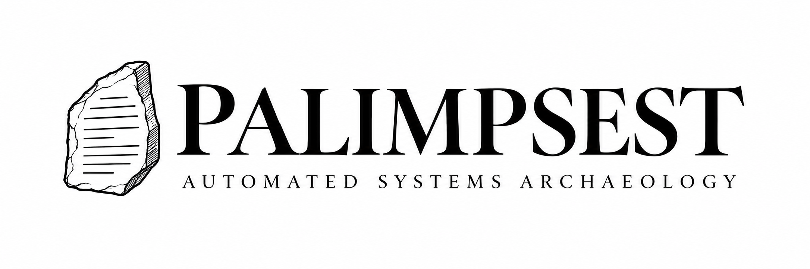

  

  <strong>Automated archaeology for legacy data systems.</strong>

  PALIMPSEST reconstructs system context from schemas, code, metadata,
  dependencies, and historical artefacts to support downstream development
  and AI-assisted engineering.

---

